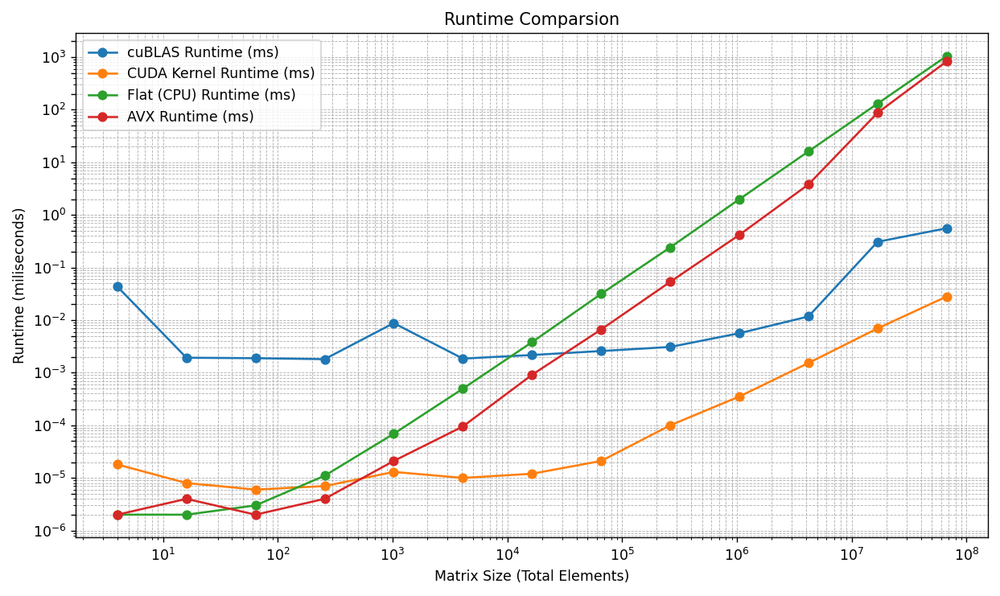
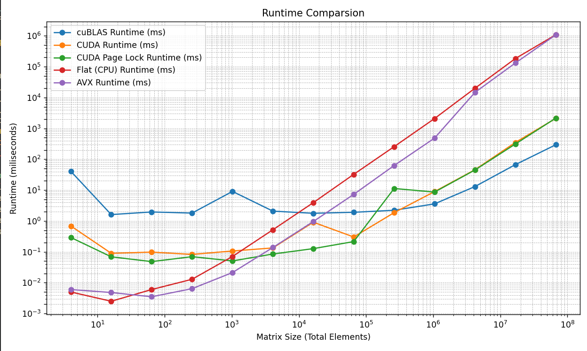

# cudavec

- Implementation of matrix multipication _(and few other operators)_ with CUDA
- All kernel functions are wrapped/can be wrapped in a helper function
- A lazy loading function `CudaContextInit()`, which speeds up the initial kernel call 4x at worst

---

## Menu

- [Quick Start](#quick-start)
  - [MSVC + CMake](#msvc--cmake)
  - [Unix Makefiles + CMake (Linux)](#unix-makefiles--cmake)
  - [Visual Studio](#msvc-visual-studio)
- [CUDA API Approach](#cuda-api-approach)
- [Benchmarks](#benchmark-results)
  - [CUDA Implementation vs Others](#cuda-vs-others-pre-cuda-129)
  - [CUDA Kernel vs Others](#kernel-benchmarking)
  - [Lazy Loading Improvements](#lazy-loading-improvement)
- [Licensing](#licensing)

---

## Quick start

### Base Requirements

- CUDA ```CUDA Runtime 12.0``` or higher
- GPU NVIDIA® GPU Geforce® 1000 series+ or NVIDIA® Workstation GPU series

### Setup

Clone the repo

```bash
git clone https://github.com/c0rs3/cudavec.git
```

---

### MSVC + CMake

#### Prerequisites for MSVC + CMake

- CMake ```version 4.0.0``` or higher
- Visual Studio Build Tools ```17.0.0``` or higher

#### Building & running the example for MSVC + CMake

build

```bash
cd cudaVec
cmake -B build -G "Visual Studio 17 2022" -S .
cmake --build build
```

and run

```bash
.\build\cudavec.exe
```

---

### Unix Makefiles + CMake

#### Setup for gnu + Unix Makefiles

- CMake ```version 4.0.0``` or higher
- GNU ```g++ (GCC) 15.0.0```
- CUDA ```CUDA Runtime 12.0``` or higher
- GPU NVIDIA® GPU Geforce® 1000 series+ or NVIDIA® Workstation GPU series

```bash
sudo pacman -S nvidia nvidia-utils nvidia-settings
sudo pacman -S base-devel gcc cuda
```

#### Building & running the example for gnu + nvcc + CMake (Linux only)

Build

```bash
cmake -B build -G "Unix Makefiles" -S .
cmake --build build
```

and execute the binary

```bash
.\build\cudavec
```

---

### MSVC (Visual Studio)

#### Setup for MSVC (Visual Studio)

- ```MSVC v142``` or higher
- ```CUDA Runtime 12.0``` or higher
- NVIDIA® GPU Geforce® 1000 series+ or NVIDIA® Workstation GPU series

#### Running the example for MSVC (Visual Studio)

- Add the files to CUDA Project

- Simply build & run

---

### Guide on usage

- Call the lazyloading function for better performance for the initial CUDA calls

```cpp
  CUDAContextInit();
```

- Initialize your vectors

```cpp
std::vector<float> A ...;
std::vector<float> B ...;
```

- Call the cuda matrix multiplication functions

```cpp
std::vector<float> res1;
{
    std::clog << "CUDA matrix multiplication total time:" << endl;
    benchmark::Timer<float> timer;
    res1 = matmul_cuda(A.data(), B.data(), dim, dim, dim);
}
// or
{
    std::clog << "CUDA matrix multiplication total time:" << endl;
    benchmark::Timer<float> timer;
    res1 = matmul_cuda_SHARED(A.data(), B.data(), dim, dim, dim);
}
// or
{
    std::clog << "CUDA matrix multiplication total time:" << endl;
    benchmark::Timer<float> timer;
    res1 = matmul_cuda_VRAM(A.data(), B.data(), dim, dim, dim);
}
```

- or any other cuda arithmetic wrapper functions

```cpp
std::vector<float> res1;
{
    std::clog << "CUDA addition total time:" << endl;
    benchmark::Timer<float> timer;
    res1 = performOperator(A, B, addKernel);
}
```

```cpp
std::vector<float> res1;
{
    std::clog << "CUDA addition total time:" << endl;
    benchmark::Timer<float> timer;
    res1 = performOperator(A, 5, addKernel);
}
```

---

## CUDA API Approach

- Pinned memory usage will of course consume a lot of RAM and the memory availability depends on the system. A switch will be implemented.

```cpp
 // Streams for async allocation, copy etc.
 cudaStream_t stream;
 cudaStatus = cudaStreamCreate(&stream);
 
 cudaMallocAsync(&dev_a, size_a * sizeof(Ty_), stream);
 cudaMallocAsync(&dev_b, size_b * sizeof(Ty_), stream);

 // a section RAM is allocated for shared usage between CPU & GPU
 cudaMallocHost(&c, M * N * sizeof(Ty_));

 // VRAM allocation
 cudaStatus = cudaMemcpyAsync(dev_a, a, size_a * sizeof(Ty_), cudaMemcpyHostToDevice, stream);
 cudaStatus = cudaMemcpyAsync(dev_b, b, size_b * sizeof(Ty_), cudaMemcpyHostToDevice, stream);
```

- Kernel launch configuration

```cpp
 // 1024 is usually the maximum threads allowed across NVIDIA GPUs
  uint32_t threadsPerBlock = deviceProps.maxThreadsPerBlock;
  dim3 threads(sqrt(threadsPerBlock), sqrt(threadsPerBlock));
  dim3 blocks((N + threads.x - 1) / threads.x,
   (M + threads.y - 1) / threads.y);
 matmul_kernel << <blocksPerGrid, threadsPerBlock, 0, stream >> > (dev_a, dev_b, c, M, N, K);
```

---

## Benchmark Results

### Test Methodology

- Even matrices of varying size are multiplied
- Each calculation is timed with it's wrapper function
- All matrix multiplication results are correct and can be verified using
 ```test_matrix_multiplication_correctness<typename>([control size])```
- _Note: for floating-point vectors sensitivity is adjusted whilst comparing_

### Specs

- CPU: Intel I9-14900HX
- GPU: RTX 4060 Mobile
- RAM: 32GB DDR5 5600mHz

### Configuration

- CUDA Toolkit Version 12.9
- Compiler: MSVC + nvcc
- Launch configuration: Release mode
- ```/O2``` and ```-use_fast_math``` enabled
- CUDA Wrapper used: `matmul_cuda_SHARED`

### CUDA vs Others (Pre CUDA 12.9)



- 80x speed up on GPU compared to CPU and 18x compared to AVX Instructions
- Comparable performance with cuBLAS
- However it's important to note that cuBLAS has an overhead of streaming the results back to the CPU

### CUDA vs Others (CUDA 13.0)



### Kernel Benchmarking

---

### Lazy Loading Improvement

#### Setup for the Test

```cpp
const uint32_t k = 10;
const uint32_t size = static_cast<uint32_t>(1) << k * 2;
const uint32_t dim = static_cast<uint32_t>(1) << k;

std::vector<float> A(size);
std::vector<float> B(size);
for (uint32_t i = 0; i < size; ++i) {
    A[i] = i;
    B[i] = i;
}

...
std::vector<float> res1;
{
    benchtools::Timer timer;
    res1 = matmul_cuda(A.data(), B.data(), dim, dim, dim);
}
{
    benchtools::Timer timer;
    res1 = matmul_cuda(A.data(), B.data(), dim, dim, dim);
}
```

#### Result

- With lazy loading

```bash
CUDA:
Duration(ms): 7ms
Duration(ns): 7033400ns
CUDA:
Duration(ms): 6ms
Duration(ns): 6937900ns
```

- Without lazy loading

```bash
CUDA:
Duration(ms): 77ms
Duration(ns): 77046496ns
CUDA:
Duration(ms): 7ms
Duration(ns): 7368700ns
```

---

### Licensing

```md
License
-------
cudavec is licensed under the MIT License (see LICENSE).

Third-Party
-----------
This project depends on NVIDIA CUDA Toolkit components (e.g., cuBLAS).
These components are licensed by NVIDIA under the CUDA EULA and are not
covered by the cudavec license. Users must install a compatible CUDA
Toolkit/driver. If you redistribute any NVIDIA runtime libraries, ensure
compliance with the CUDA EULA for your CUDA version.
```

### Trademarks

```md
Trademarks
----------
NVIDIA, the NVIDIA logo, CUDA, cuBLAS, GeForce, and GeForce RTX are trademarks
or registered trademarks of NVIDIA Corporation in the United States and other
countries. All other trademarks are the property of their respective owners.
No endorsement by NVIDIA is implied.
```
